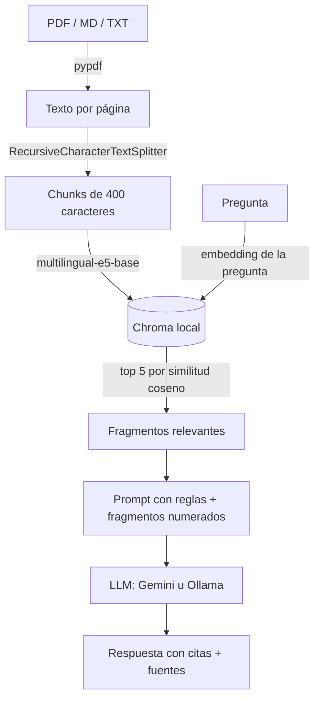

# RAG Document Assistant

Asistente RAG para consultar documentos internos con FastAPI, LangChain y Chroma.

Prototipo desarrollado como prueba técnica para el cargo de **AI Developer Engineer Junior**. El asistente responde preguntas **usando únicamente la información de los documentos cargados** e indica el documento, la página y el fragmento usados en cada respuesta.

> Los documentos de `data/docs/` pertenecen a una **empresa ficticia** (Nimbus Analytics) y fueron creados para esta prueba.

## Contenido

1. [Descripción de la solución](#descripción-de-la-solución)
2. [Estructura del proyecto](#estructura-del-proyecto)
3. [Dependencias](#dependencias)
4. [Instalación](#instalación)
5. [Ejecución](#ejecución)
6. [Cómo cargar documentos](#cómo-cargar-documentos)
7. [Cómo hacer preguntas](#cómo-hacer-preguntas)
8. [Evaluación](#evaluación)
9. [Decisiones técnicas](#decisiones-técnicas)
10. [Limitaciones conocidas](#limitaciones-conocidas)
11. [Mejoras futuras](#mejoras-futuras)
12. [Uso de herramientas de AI](#uso-de-herramientas-de-ai)

---

## Descripción de la solución



El flujo tiene siete pasos:

1. **Carga:** lee archivos PDF (un fragmento de texto por página, numeradas desde 1), Markdown y texto plano.
2. **Chunking:** divide el texto en fragmentos de 400 caracteres con 50 de solapamiento. Cada fragmento recibe un identificador legible (`archivo#n`).
3. **Embeddings:** convierte cada fragmento en un vector con `intfloat/multilingual-e5-base`, un modelo que corre localmente y funciona bien en español.
4. **Vector store:** guarda los vectores en Chroma, persistido en la carpeta `vectorstore/`. El índice se reutiliza entre ejecuciones y solo se reconstruye cuando cambian los documentos.
5. **Pregunta:** el usuario consulta por API o por consola.
6. **Recuperación:** busca los 5 fragmentos más similares a la pregunta (similitud coseno).
7. **Generación:** el LLM responde siguiendo reglas explícitas (usar solo los fragmentos, citar `[n]`, separar lo que sí está de lo que no) y el sistema devuelve la respuesta junto con las fuentes.

El LLM es **configurable desde el `.env`** sin tocar código: Gemini (API, capa gratuita) u Ollama (100 % local).

## Estructura del proyecto

```
rag-document-assistant/
├── app/
│   ├── config.py           # Configuración desde .env (pydantic-settings)
│   ├── loaders.py          # Carga de PDF, Markdown y TXT con pypdf
│   ├── chunking.py         # División en fragmentos con IDs únicos
│   ├── providers.py        # Creación del modelo de embeddings y del LLM
│   ├── vectorstore.py      # Chroma: creación, conteo y reindexación
│   ├── retriever.py        # Búsqueda por similitud + umbral
│   ├── prompts.py          # Prompt del asistente
│   ├── generator.py        # Llamada al LLM y normalización de la respuesta
│   ├── rag.py              # Servicio que integra todo el flujo
│   ├── cli.py              # Interfaz por consola
│   ├── schemas.py          # Modelos de entrada y salida de la API
│   ├── main.py             # Creación de la API (FastAPI)
│   └── routers/            # Endpoints agrupados por funcionalidad
│       ├── health.py       # Estado del servicio
│       ├── documents.py    # Listar, subir y reindexar documentos
│       └── qa.py           # Preguntas al asistente
├── data/docs/              # Documentos a consultar
├── evaluation/
│   ├── questions.json      # Preguntas de prueba por categoría
│   ├── run_eval.py         # Script de evaluación
│   └── results_*.md/json   # Resultados por modelo (qwen2.5 y Gemini)
├── tests/                  # Pruebas automáticas con pytest
│   ├── conftest.py         # Fixtures y modelos falsos compartidos
│   ├── test_loaders.py
│   ├── test_chunking.py
│   ├── test_prompts.py
│   ├── test_rag_service.py
│   └── test_api.py
├── docs/
│   ├── AI_ASSISTED_DEV.md  # Uso de herramientas de AI en el desarrollo
│   └── evidence/
│       ├── diagnostic/     # Salidas de cada iteración del diagnóstico
│       └── execution/      # Capturas del sistema funcionando
├── vectorstore/            # Índice de Chroma (se genera al indexar, no se sube)
├── .env.example            # Plantilla de configuración
├── .gitignore
├── pytest.ini              # Configuración de pytest
├── requirements.txt
└── README.md
```

Toda la lógica vive en `RAGService` (`app/rag.py`). La consola, la API y la evaluación son distintas formas de usar ese mismo servicio.

## Dependencias

| Paquete                                                         | Uso                             |
| --------------------------------------------------------------- | ------------------------------- |
| `langchain`, `langchain-core`, `langchain-text-splitters`       | Orquestación del RAG y chunking |
| `langchain-chroma`                                              | Vector store local              |
| `langchain-huggingface`, `sentence-transformers`, `torch` (CPU) | Embeddings locales              |
| `langchain-google-genai` / `langchain-ollama`                   | Conexión con el LLM elegido     |
| `pypdf`                                                         | Extracción de texto de PDF      |
| `fastapi`, `uvicorn`, `python-multipart`                        | API REST y carga de archivos    |
| `pydantic-settings`, `python-dotenv`                            | Configuración                   |

Las versiones exactas están en `requirements.txt`.

**Requisitos:** Python 3.10 a 3.12, unos 3 GB libres para dependencias y modelos, y **una** de estas opciones para el LLM:

- una API key gratuita de Gemini, o
- Ollama instalado localmente.

## Instalación

```bash
git clone https://github.com/J17023/rag-document-assistant.git
cd rag-document-assistant

python -m venv .venv
source .venv/bin/activate          # Windows: .venv\Scripts\activate

# PyTorch en versión CPU (más liviano que la versión con GPU)
pip install torch --index-url https://download.pytorch.org/whl/cpu
pip install -r requirements.txt

cp .env.example .env
```

Luego edita `.env` y elige el LLM:

**Opción A: Gemini (recomendada, mejores resultados).** Crea una API key gratuita en [Google AI Studio](https://aistudio.google.com) y pégala en `GOOGLE_API_KEY`:

```
LLM_PROVIDER=google_genai
LLM_MODEL=gemini-3.8-flash
GOOGLE_API_KEY=tu-key
```

**Opción B: Ollama (100 % local, los documentos no salen del equipo).**

```bash
curl -fsSL https://ollama.com/install.sh | sh
ollama pull qwen2.5:7b
```

```
LLM_PROVIDER=ollama
LLM_MODEL=qwen2.5:7b
```

> La primera ejecución descarga el modelo de embeddings (~1.1 GB). Las siguientes usan la copia en caché.

## Ejecución

### API

```bash
uvicorn app.main:app --reload
```

La documentación interactiva (Swagger) queda disponible en **http://localhost:8000/docs**, donde se pueden probar todos los endpoints desde el navegador.

### Consola

```bash
python -m app.cli ingest                                       # indexa los documentos
python -m app.cli ask "¿Cuántos días de vacaciones tengo?"     # una pregunta
python -m app.cli chat                                         # modo interactivo
```

## Cómo cargar documentos

Formatos soportados: `.pdf`, `.md` y `.txt`.

**Opción 1: subirlos por la API.** Se guardan en `data/docs/` y el índice se reconstruye automáticamente:

```bash
curl -X POST http://localhost:8000/documents/upload -F "file=@mi_documento.pdf"
```

**Opción 2: copiarlos a `data/docs/`** y reindexar:

```bash
python -m app.cli ingest
# o con la API:
curl -X POST http://localhost:8000/documents/ingest
```

Si el índice está vacío, se construye automáticamente con la primera pregunta.

En [`docs/evidence/execution/`](docs/evidence/execution/05_upload_document.png) está la prueba de la carga por la API: se subió un documento nuevo (`politica_capacitacion.md`) y el índice se reconstruyó automáticamente, pasando de 2 documentos y 21 fragmentos a 3 documentos y 26. El rechazo de formatos no soportados y archivos vacíos (error 400) está cubierto por las pruebas de `tests/test_api.py`.

## Cómo hacer preguntas

### Con la API

```bash
curl -X POST http://localhost:8000/ask \
  -H "Content-Type: application/json" \
  -d '{"question": "¿Cuánto es el auxilio de conectividad para un trabajador 100 % remoto?"}'
```

Respuesta (resumida):

```json
{
  "question": "¿Cuánto es el auxilio de conectividad para un trabajador 100 % remoto?",
  "answer": "El auxilio de conectividad mensual para un trabajador 100 % remoto es de 180 000 COP [2].",
  "sources": [
    {
      "document": "manual_trabajo_remoto.pdf",
      "page": 1,
      "chunk_id": "manual_trabajo_remoto.pdf#4",
      "score": 0.84,
      "excerpt": "Modalidad Auxilio mensual Híbrida 120 000 COP 100 % remota 180 000 COP..."
    }
  ]
}
```

Cada respuesta incluye las **fuentes**: documento, página (en PDF), identificador del fragmento, score de similitud y un extracto del texto usado.

### Con la consola

```bash
python -m app.cli ask "¿Cuántos días de vacaciones tengo al año?"
```

### Endpoints

| Método | Ruta                | Descripción                                |
| ------ | ------------------- | ------------------------------------------ |
| GET    | `/health`           | Estado del servicio y modelos configurados |
| GET    | `/documents`        | Lista los documentos disponibles           |
| POST   | `/documents/upload` | Sube un documento y reindexa               |
| POST   | `/documents/ingest` | Reindexa todos los documentos              |
| POST   | `/ask`              | Responde una pregunta con sus fuentes      |

Códigos de error: **400** (archivo vacío o formato no soportado), **413** (archivo de más de 10 MB), **422** (pregunta inválida, por ejemplo de menos de 3 caracteres) y **502** (el LLM no respondió: cuota agotada, Ollama apagado o key inválida).

## Evaluación

Las preguntas de `evaluation/questions.json` cubren los casos que pide la prueba: respondibles, parcialmente respondible y no respondibles, más una que combina dos documentos y una de conocimiento general, para verificar que el modelo no use información externa.

```bash
python -m evaluation.run_eval              # con Ollama
python -m evaluation.run_eval --delay 15   # con Gemini (respeta el límite por minuto)
```

El script genera una tabla por modelo en `evaluation/`, con la pregunta, la respuesta esperada, la respuesta generada, las fuentes y el tiempo. Las columnas **¿Correcta?** y **Observación** se completaron manualmente.

### Resultados

| #   | Pregunta                                                               | Tipo            | qwen2.5:7b (local) | Gemini (API) |
| --- | ---------------------------------------------------------------------- | --------------- | ------------------ | ------------ |
| 1   | ¿Cuántos días de vacaciones tengo al año?                              | Respondible     | ✅ (resumida)      | ✅           |
| 2   | ¿Cuánto es el auxilio de conectividad para un trabajador 100 % remoto? | Respondible     | ✅                 | ✅           |
| 3   | ¿Cuántos días de vacaciones tengo y cuánto cubre el seguro de salud?   | Parcial         | ✅                 | ✅           |
| 4   | ¿Cuál es el salario de un analista junior?                             | No respondible  | ✅                 | ✅           |
| 5   | Si soy remoto y quiero hacer un diplomado, ¿qué auxilios recibo?       | Multi documento | ❌                 | ✅           |
| 6   | ¿Cuál es la capital de Francia?                                        | No respondible  | ✅                 | ✅           |
|     | **Total**                                                              |                 | **5/6**            | **6/6**      |

Detalle completo: [resultados con qwen2.5:7b](evaluation/results_ollama-qwen2.5-7b.md) · [resultados con Gemini](evaluation/results_google-genai-gemini-3.8-flash.md)

**Conclusión:** con el mismo pipeline, los mismos fragmentos recuperados y el mismo prompt, la única diferencia entre ambas corridas es el modelo. En la pregunta 5, qwen2.5:7b recibió los dos fragmentos necesarios, pero omitió el auxilio educativo y tomó el monto de la modalidad híbrida. Esto confirma que la falla es de **capacidad de razonamiento del modelo**, no de la recuperación. La elección del modelo es un balance entre **calidad** (Gemini) y **privacidad y costo cero** (Ollama).

En ambos modelos, las preguntas 4 y 6 muestran que el sistema **no inventa información ni usa conocimiento externo**: aunque cualquier LLM sabe cuál es la capital de Francia, el asistente indica que no está en los documentos.

## Decisiones técnicas

El sistema se desarrolló primero como un script de punta a punta (_spike_) para validar el flujo, y luego se reorganizó en módulos. Las decisiones principales salieron de diagnosticar los resultados de cada versión (las salidas están en [`docs/evidence/`](docs/evidence/)):

| Decisión                                                                           | Motivo                                                                                                                                                                                                      |
| ---------------------------------------------------------------------------------- | ----------------------------------------------------------------------------------------------------------------------------------------------------------------------------------------------------------- |
| **Embeddings `multilingual-e5-base`** en lugar de `paraphrase-multilingual-MiniLM` | MiniLM está entrenado para detectar frases parecidas, no para búsqueda. No recuperaba el fragmento del auxilio de conectividad. e5 está entrenado para emparejar preguntas con pasajes y resolvió ese caso. |
| **Chunks de 400 caracteres** en lugar de 800                                       | Con 800, el dato del auxilio quedaba al final de un fragmento dedicado a horarios, y su embedding no se parecía a la pregunta.                                                                              |
| **Prompt con reglas por pasos y un ejemplo** (_few-shot_)                          | Con una instrucción de rechazo literal ("responde exactamente: No encuentro..."), el modelo se rendía ante preguntas parcialmente respondibles. Un ejemplo de respuesta parcial corrigió el comportamiento. |
| **Se descartó una regla para "combinar documentos"**                               | Con qwen2.5:7b mejoraba a medias la pregunta 5, pero rompía la pregunta parcial, que ya funcionaba. Con Gemini no hacía falta.                                                                              |
| **Loaders propios con `pypdf`**                                                    | `langchain-community` dejó de mantenerse; la carga se implementó directamente en unas 40 líneas.                                                                                                            |
| **Índice persistente**                                                             | El script inicial reindexaba en cada ejecución. Ahora Chroma conserva el índice y solo se reconstruye cuando cambian los documentos.                                                                        |
| **LLM configurable** (`init_chat_model`)                                           | Permite cambiar de proveedor desde el `.env`. Fue útil al agotarse la cuota gratuita de Gemini durante el desarrollo.                                                                                       |
| **Inyección de dependencias** en `RAGService`                                      | El servicio recibe los modelos desde afuera, lo que permite reutilizarlo en la API, la consola y la evaluación, y probarlo con modelos falsos.                                                              |

## Limitaciones conocidas

- **El umbral de similitud casi no filtra.** e5 asigna scores en un rango estrecho y alto (≈0.77–0.87 en estos documentos), incluso a fragmentos irrelevantes. Por eso la decisión de "no encontré" recae principalmente en el LLM.
- **Los modelos locales pequeños tienen un límite.** Con qwen2.5:7b, las preguntas que combinan varios documentos pueden fallar, y cada ajuste del prompt puede mejorar un caso y empeorar otro.
- **Cuota gratuita de Gemini:** tiene límites por minuto y por día (20 solicitudes por modelo al momento de las pruebas). Si se agota, se puede usar Ollama cambiando `LLM_PROVIDER` en el `.env`. Además, los nombres de los modelos cambian con el tiempo: `gemini-2.5-flash` dejó de estar disponible durante el desarrollo.
- **Reindexación completa:** al subir un documento se reindexan todos. Es suficiente para pocos documentos, pero no escala.
- **Las tablas de los PDF pierden su estructura** al extraer el texto: cada celda queda en una línea separada.
- **Sin memoria de conversación:** cada pregunta es independiente.
- **Sin autenticación** en la API.
- **El límite de 10 MB se valida después de leer el archivo** en memoria. En producción debería aplicarse antes (por ejemplo, en el servidor web).
- **Con Gemini, los fragmentos recuperados se envían a Google.** Para documentos confidenciales conviene usar Ollama.

## Mejoras futuras

**Reranking de los fragmentos recuperados:** con e5 los scores quedan en un rango estrecho (≈0.77–0.87) incluso para fragmentos irrelevantes, por lo que el umbral de similitud casi no filtra. Un cross-encoder reordenaría los candidatos evaluando cada pregunta junto con cada fragmento, con scores más separados entre lo relevante y lo irrelevante, de modo que el umbral sí permita detectar cuándo la respuesta no está en los documentos.

- **Chunking por secciones**, usando los encabezados del Markdown y los títulos del PDF en lugar de un número fijo de caracteres.
- **Extracción de tablas** con una librería especializada, para conservar filas y columnas.
- **Evaluación automática** con métricas de fidelidad y relevancia (por ejemplo, RAGAS) y un conjunto de preguntas más amplio.
- **Indexación incremental:** indexar solo los documentos nuevos o modificados.
- **Memoria conversacional** para preguntas de seguimiento.
- **Despliegue en la nube:** API en un contenedor (AWS EC2 o Lambda), documentos en S3 y un vector store gestionado.
- **Autenticación** y control de acceso por documento.
- **Respaldo automático entre LLMs (_fallback_):** si el proveedor principal falla (cuota agotada, tiempo de espera agotado o servicio caído), cambiar automáticamente al otro, por ejemplo de Gemini a Ollama. Así el asistente sigue respondiendo aunque uno de los dos deje de funcionar. LangChain lo permite con `with_fallbacks()`, y el proveedor de respaldo se definiría en el `.env` igual que el principal.
- **Caché de preguntas frecuentes:** detectar las preguntas que se repiten y responderlas sin llamar al LLM. Funcionaría en tres pasos:
  1. **Agrupar preguntas equivalentes:** comparar cada pregunta nueva con las anteriores usando los mismos embeddings. Si la similitud supera un umbral alto (por ejemplo, ≥ 0.95), se cuenta como la misma pregunta ("¿Cuántos días de vacaciones tengo?" y "¿Cuántos días de vacaciones me corresponden?").
  2. **Contar la frecuencia:** llevar un conteo de cuántas veces se hace cada pregunta.
  3. **Decidir con un umbral de frecuencia:** cuando una pregunta supera el umbral (por ejemplo, 5 veces), se guarda su respuesta con sus fuentes y las siguientes veces se devuelve desde la caché. Las preguntas nuevas o poco frecuentes siguen el

## Uso de herramientas de AI

Ver [docs/AI_ASSISTED_DEV.md](docs/AI_ASSISTED_DEV.md).
